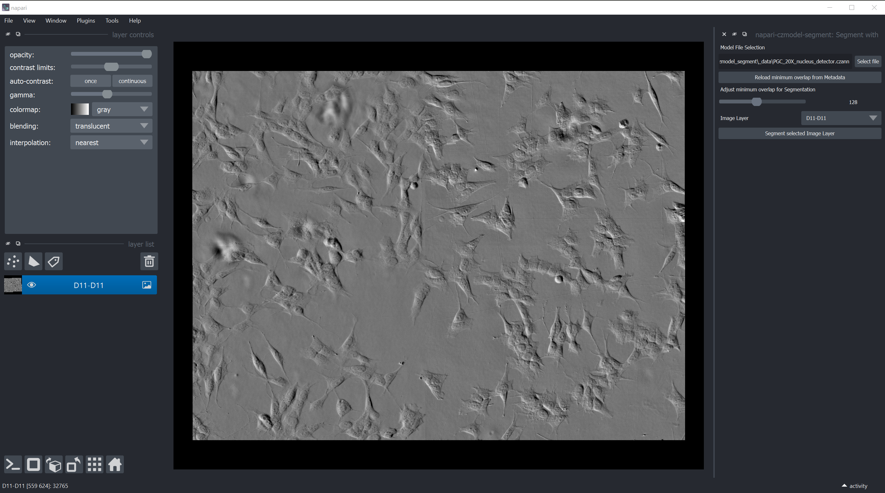
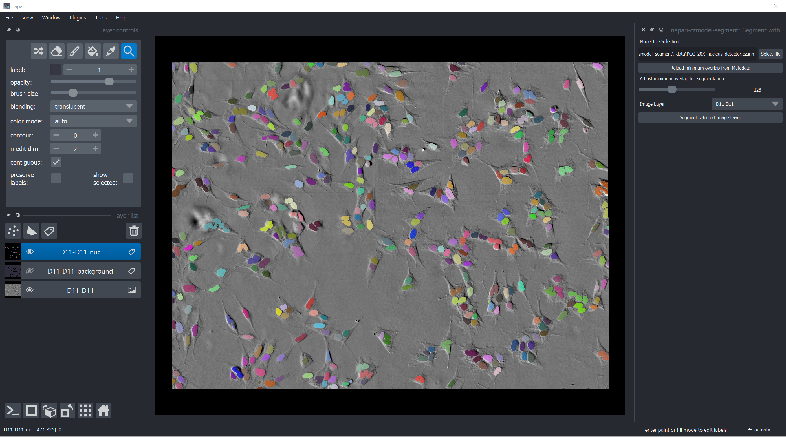

# napari-czann-segment

Semantic Segmention using DeepLearning ONNX models packaged as *.czann files.

----------------------------------

This [napari] plugin was generated with [Cookiecutter] using [@napari]'s [cookiecutter-napari-plugin] template.

<!--
Don't miss the full getting started guide to set up your new package:
https://github.com/napari/cookiecutter-napari-plugin#getting-started

and review the napari docs for plugin developers:
https://napari.org/plugins/index.html
-->

- Provides sematic segmentation using Deep Learning models (ONNX) packages as a *.czann file.
- Status: Pre-Alpha - Use it at your own risk!

## Installation

- **Please clone this repository first using your favorite tool.**

- **Ideally one creates a new [conda] environment or use an existing environment that already contains [Napari].**

Feel free to create a new environment using the [YAML](env_napari_czann_segment.yml) file at your own risk:

    cd the-github-repo-with-YAML-file
    conda env create --file conda_env_napari_czann_segment.yml
    conda activate napari_czmodel

- **Install the plugin locally**

Please run the the following command:

    pip install -e .

You can install `napari-czann-segment` via [pip] soon, when it will be published:

    pip install napari-czann-segment

To install latest development version:

    pip install git+https://github.com/sebi06/napari_czann_segment.git

## What does the plugin do

The plugin allows you read open a *.czann file contains das Deep Neural Network (ONNX) for semantic segmentation and metadata. Such a model con be created in two ways:

- Train the segmentation model fully automated on [APEER] and download the *.czann file
- Train your model in a Jupyter notebook etc. and package it using the [czmodel] python package as an *.czann
- To process also larger multi-dimensional images it uses the [cztile] package to chunk the individual 2d arrays using a specific overlap.

## Using this plugin

### Sample Data

A test image and a *.czann model file can be downloaded [here](https://github.com/sebi06/napari-czann-segment/tree/main/src/napari_czann_segment/_data).

- `PGC_20X.ome.tiff` --> use `PGC_20X_nucleus_detector.czann` to segment

In order to use this plugin the user has to do the following things:

- Open the image using "File - Open Files(s)" (requires [napari-aicsimageio] plugin).
- Activate the **napari-czann-segment** plugin from "Plugins".
- Select a *.czann file to use the model for segmentation.

- Adjust the minimum overlap used to the tiling (optional).
- Select the layer to be segmented.
- Press **Segment Selected Image Layer" to run the segmentation.

### Remarks

- Only the CPU will be used for the inference using the ONNX runtime for the [ONNX-CPU] runtime
- GPUs are not supported yet and will require [ONNX-GPU] runtime

## Contributing

Contributions and Feedback are very welcome.

## License

Distributed under the terms of the [BSD-3] license,
"napari-czann-segment" is free and open source software

## Issues

If you encounter any problems, please [file an issue] along with a detailed description.

[napari]: https://github.com/napari/napari
[Cookiecutter]: https://github.com/audreyr/cookiecutter
[@napari]: https://github.com/napari
[MIT]: http://opensource.org/licenses/MIT
[BSD-3]: http://opensource.org/licenses/BSD-3-Clause
[GNU GPL v3.0]: http://www.gnu.org/licenses/gpl-3.0.txt
[GNU LGPL v3.0]: http://www.gnu.org/licenses/lgpl-3.0.txt
[Apache Software License 2.0]: http://www.apache.org/licenses/LICENSE-2.0
[Mozilla Public License 2.0]: https://www.mozilla.org/media/MPL/2.0/index.txt
[cookiecutter-napari-plugin]: https://github.com/napari/cookiecutter-napari-plugin
[file an issue]: https://github.com/sebi06/napari-czann-segment/issues
[napari]: https://github.com/napari/napari
[tox]: https://tox.readthedocs.io/en/latest/
[pip]: https://pypi.org/project/pip/
[PyPI]: https://pypi.org/
[czmodel]: https://pypi.org/project/czmodel/
[cztile]: https://pypi.org/project/cztile/
[APEER]: https://www.apeer.com
[napari-aicsimageio]: https://github.com/AllenCellModeling/napari-aicsimageio
[ONNX-GPU]: https://pypi.org/project/onnxruntime-gpu/
[ONNX-CPU]: https://pypi.org/project/onnxruntime/
[conda]: https://docs.conda.io/projects/conda/en/latest/user-guide/getting-started.html
